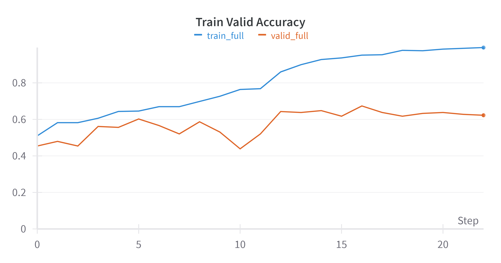
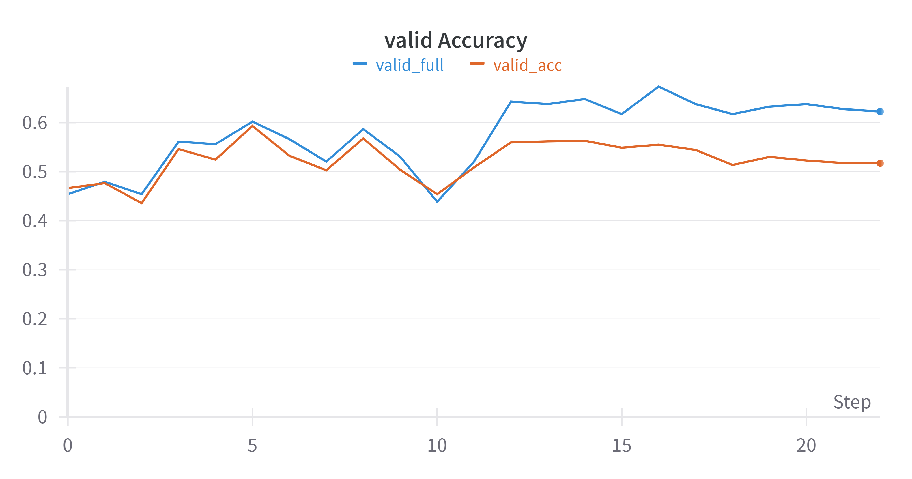

## Configuration
- **Architecture**: mobilenet
- **Epochs**: 20
- **Fragments**: 9 central
- **Batch Size**: 16
- **Number of Classes**: 5
- **Image Preprocessing**: -

## Augmentations
None

## Training Setup
- **Optimizer**: AdamW
  ```python
  torch.optim.AdamW(mobilenet_v2_model.parameters())

- **Loss Function**: CrossEntropyLoss with class weights. Class Weights: [0.1845, 0.1877, 0.1960, 0.2145, 0.2656]
  ```python
  nn.CrossEntropyLoss(weight=class_weights.to(device))

- **Schedular**: 
  ```python
  milestones = [12, 15, 26]
  gamma = 0.3
  torch.optim.lr_scheduler.MultiStepLR(optimizer, milestones, gamma=gamma)

## Results

### Точность на объединенных тренировочных и валидационных данных


### Потери на объединенных тренировочных и валидационных данных


### Точность для полных картинок на тренировочных и валидационных данных


### Зависимость качества на полных изображениях от качества на фрагментах


## Notes:
размер изображений - 224x224
Качество на полных изображениях - 62.2