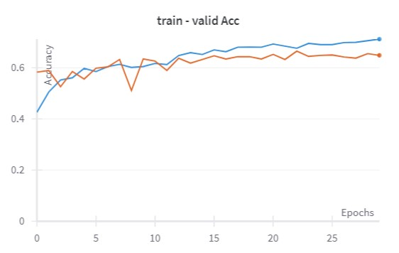
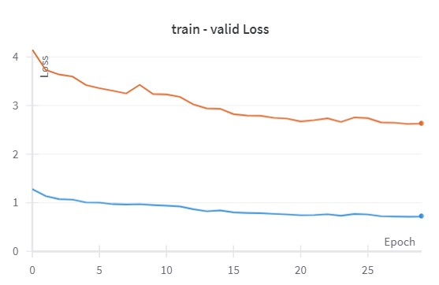
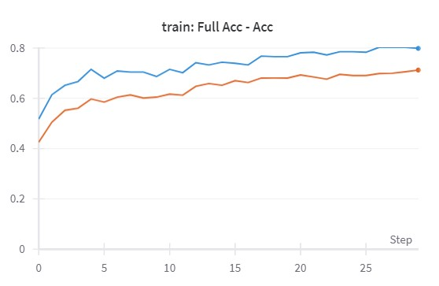
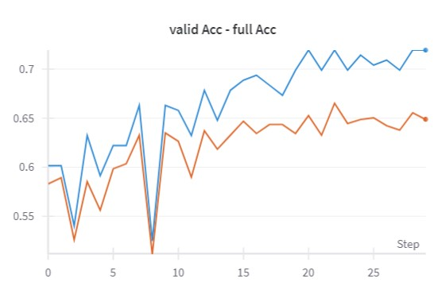
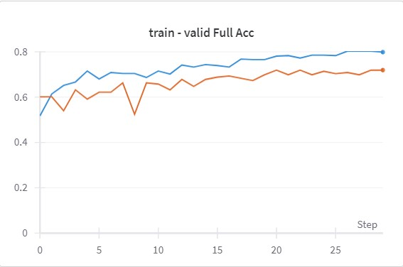

## Configuration
- **Architecture**: mobilenet-v2
- **Epochs**: 30
- **Fragments**: 9
- **Batch Size**: 32
- **Number of Classes**: 5
- **Image Preprocessing**: Нормализация без обрезки пикселей

## Augmentations
We have utilized several augmentation techniques to improve the model's performance and robustness:
1. **Horizontal Flip**: Probability of 0.3
2. **Rotation**: Limited to 30 degrees with a probability of 0.3
3. **Salt and Pepper**: Applied only to the pepper with a ratio of 0.0
4. **Elastic Transform**: With parameters alpha=2, sigma=20, alpha_affine=10, and a probability of 0.4
  ```python
  HorizontalFlip(p=.3)
  Rotate(limit=30, p=.3)
  SaltAndPepper(salt_ratio=.4)
  ```

## Training Setup
- **Optimizer**: AdamW

- **Loss Function**: CrossEntropyLoss with class weights. Class Weights: [0.1845, 0.1877, 0.1960, 0.2145, 0.2656]
  ```python
  nn.CrossEntropyLoss(weight=class_weights.to(device))

- **Schedular**: 
  ```python
  milestones = [12, 15, 26]
  gamma = 0.3
  torch.optim.lr_scheduler.MultiStepLR(optimizer, milestones, gamma=gamma)

## Results

### Accuracy train - valid:


### Loss train - valid:


### Full Acc - Acc train:


### Full Acc - Acc valid:


### Full Acc train - valid


## Notes:
С нормализацией, без обрезания пикселей и без фильтров, с новым scheduler
Аугментация - соль + перец, размер изображений - 224x224
Accuracy train =  71.2
Accuracy valid =  64.9
Full Accuracy train =  79.8
Full Accuracy valid =  71.9
