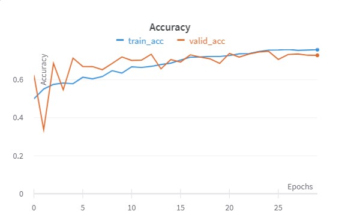
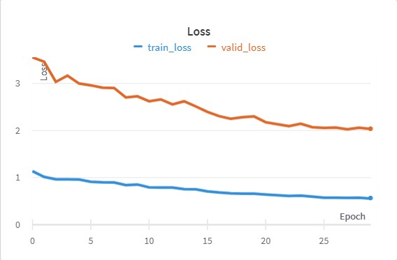
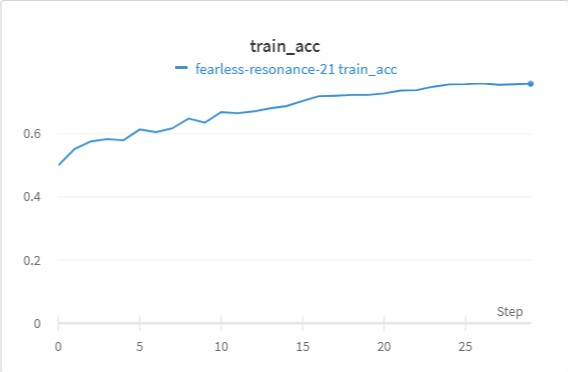
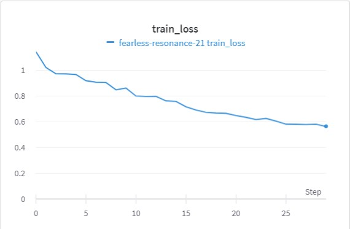
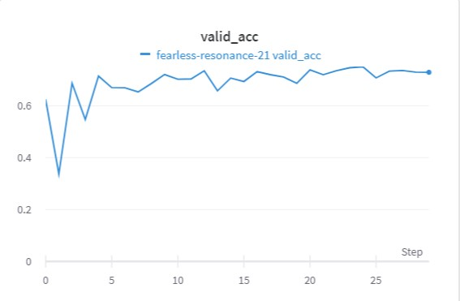
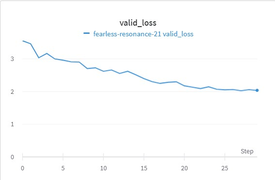

## Configuration
- **Architecture**: MobileNet-v2
- **Epochs**: 30
- **Fragments**: 9 central parts
- **Batch Size**: 16
- **Number of Classes**: 4
- **Image Preprocessing**: Not specified

## Augmentations
We have utilized several augmentation techniques to improve the model's performance and robustness:
1. **Horizontal Flip**: Probability of 0.3
2. **Rotation**: Limited to 30 degrees with a probability of 0.3
3. **Salt and Pepper**: Applied only to the pepper with a ratio of 0.0
4. **Elastic Transform**: With parameters alpha=2, sigma=20, alpha_affine=10, and a probability of 0.4
  ```python
  HorizontalFlip(p=.3)
  Rotate(limit=30, p=.3)
  SaltAndPepper(salt_ratio=0.0)
  ElasticTransform(alpha=2, sigma=20, alpha_affine=10, p=.4)
  ```

## Training Setup
- **Optimizer**: AdamW
  ```python
  torch.optim.AdamW(mobilenet_v2_model.parameters())

- **Loss Function**: CrossEntropyLoss with class weights. Class Weights: [0.0094, 0.0096, 0.0112, 0.0101]
  ```python
  nn.CrossEntropyLoss(weight=class_weights.to(device))

- **Schedular**: 
  ```python
  torch.optim.lr_scheduler.StepLR(optimizer, step_size=5, gamma=0.6)

## Results

### Точность на объединенных тренировочных и валидационных данных


### Потери на объединенных тренировочных и валидационных данных


### Точность на тренировочных данных


### Потери на тренировочных данных


### Точность на валидационных данных


### Потери на валидационных данных


## Notes:
Качество на полных изображениях - 76.023